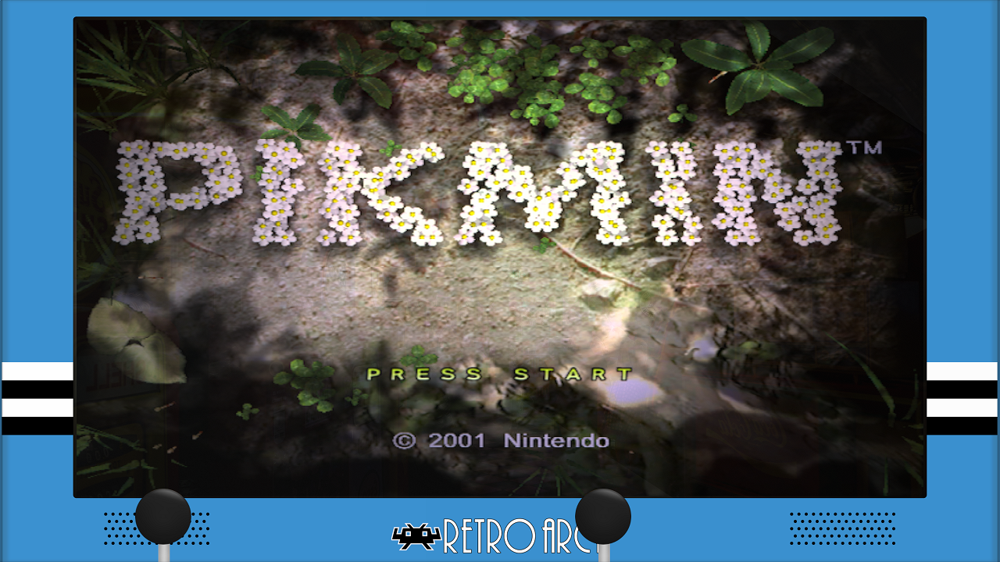
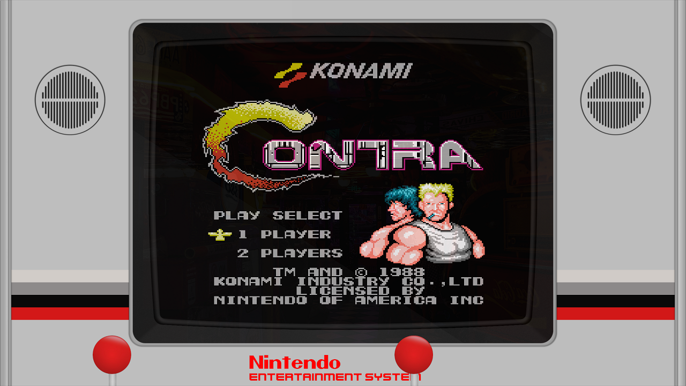

# Console Arcade Lite

Lite version is meant for those that want to use Console Arcade style on slower devices.

#### To Use
Download images folder and one of the preset or overlay cfg folders

## koko-aio / Mega Bezel

- Place koko-aio_packs or Mega_Bezel_Packs folder inside of RetroArch/shaders_slang folder  
- Put images folder inside of Console-Arcade-Lite folder

## overlays

- Place overlays folder over RetroArch folder  
- Put images folder inside of console-arcade-lite folder

 -- Settings

<pre>
4x3
---------------------------
1080p: 432, 116, 1056, 798
1440p: 580, 156, 1404, 1054
2160p: 864, 234, 2110, 1586

16x9
--------------------------
1080p: 140, 32, 1642, 928
1440p: 186, 42, 2190, 1236
2160p: 280, 62, 3280, 1856

Game Boy and Game Gear
---------------------------
1080p: 488, 86, 944, 852
1440p: 650, 114, 1260, 1136
2160p: 974, 172, 1890, 1704

Game Boy Advance
---------------------------
1080p: 344, 70, 1230, 822
1440p: 460, 94, 1640, 1094
2160p: 690, 140, 2460, 1644

Nintendo 64
-----------
1080p: 410, 88, 1108, 848
1440p: 542, 118, 1480, 1132
2160p: 770, 154, 2270, 2180

Vertical
----------------------------
1080p: 664, 114, 594, 790
1440p: 886, 152, 788, 1052
2160p: 1330, 230, 1182, 1576
</pre>

